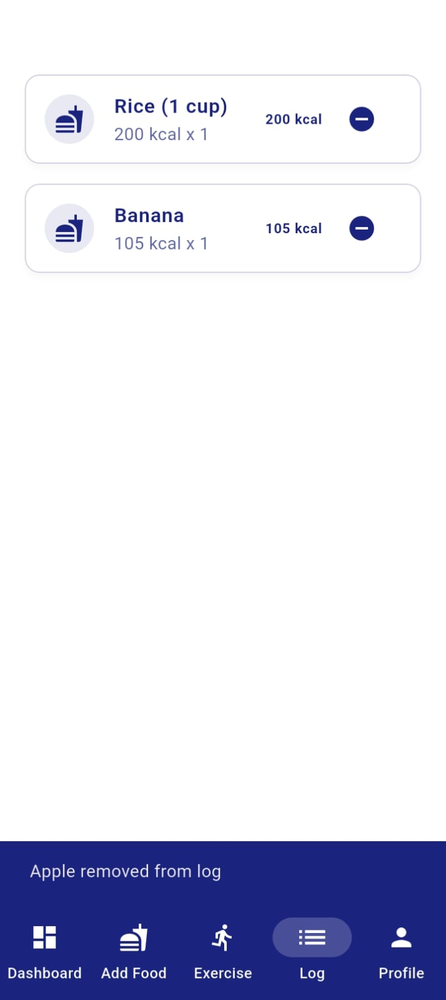

# FitTrackr

FitTrackr is a cross-platform fitness tracking app built with Flutter. It helps users monitor their workouts, track progress, and stay motivated on their fitness journey. The app features a user-friendly interface, workout logging, progress visualization, and customizable fitness goals. FitTrackr is designed for anyone looking to improve their health and fitness, whether you’re a beginner or an experienced athlete.

## Download

[Download the FitTrackr app here](build/app/outputs/flutter-apk/app-release.apk)

## Features
- Workout logging
- Progress tracking and visualization
- Customizable fitness goals
- User-friendly interface
- Cross-platform support (Android, iOS, Web, Desktop)

## App Screenshots

### Main Dashboard

The main dashboard provides an overview of your daily progress, calorie tracking, fitness goal, and motivational tips to help you stay on track.

### Splash Screen

The splash screen welcomes you to FitTrackr with a clean and simple loading interface.

### Workout Page

The workout page allows you to log exercises, select muscle groups, and track your workout routines efficiently.

### Profile Page

The profile page displays your personal information, fitness goals, and daily calorie targets in a clear and organized manner.

### Food Log Page

The food log page helps you track your meals and calories, with options to search for foods or add custom entries.

## Getting Started
To run the app locally:

1. Make sure you have [Flutter](https://flutter.dev/docs/get-started/install) installed.
2. Clone this repository.
3. Run `flutter pub get` to install dependencies.
4. Run `flutter run` to launch the app on your device or emulator.

## Contributing
Contributions are welcome! Please open an issue or submit a pull request for any improvements or bug fixes.

## License
This project is licensed under the MIT License.
